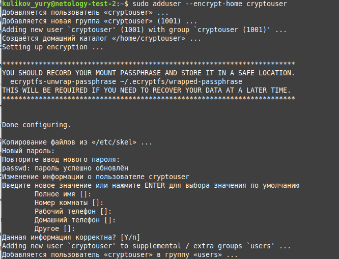
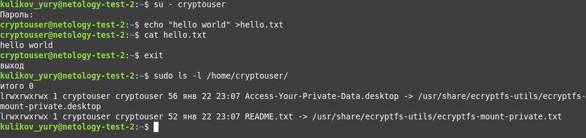
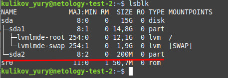
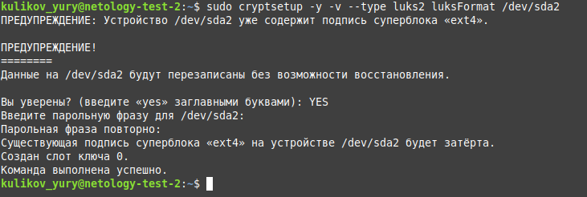
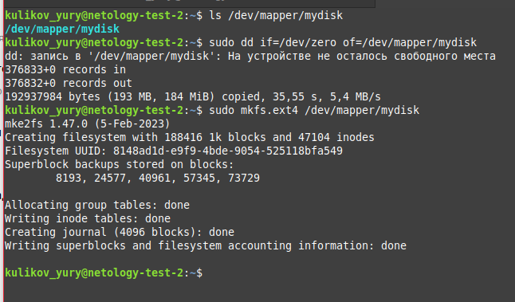
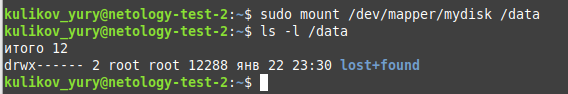
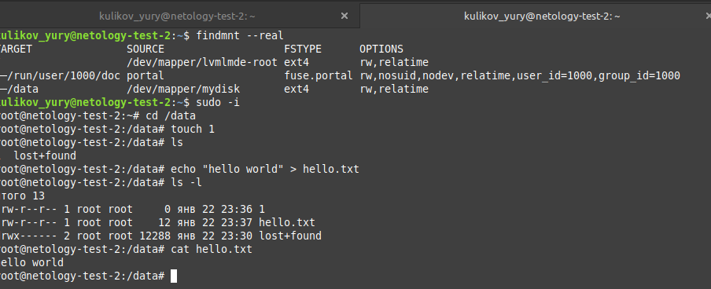
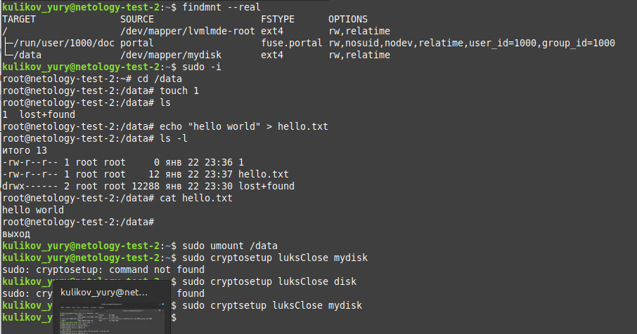

# Домашнее задание к занятию "`Защита хоста`" - `Куликов Юрий`


### Задание 1
1. Установите eCryptfs.
2. Добавьте пользователя cryptouser.
3. Зашифруйте домашний каталог пользователя с помощью eCryptfs.

`В качестве ответа пришлите снимки экрана домашнего каталога пользователя с исходными и зашифрованными данными.`


### Решение 1
Добавляем пользователя с именем cryptouser, шифруя его домашний каталог с помощью ключа --encrypt-home

```
sudo adduser --encrypt-home cryptouser
```



Для примера, авторизуемся под пользователем cryptouser. Создаём файл hello.txt с содержимым "hello world".
Выходим из под данного пользователя.

Проверяем содержимое домашнего каталога для cryptouser. Зашифрованного файла не видим.

В файле README.txt содержится упоминание, о том что данный каталог зашифрован.




---

### Задание 2

1. Установите поддержку LUKS.
2. Создайте небольшой раздел, например, 100 Мб.
3. Зашифруйте созданный раздел с помощью LUKS.

`В качестве ответа пришлите снимки экрана с поэтапным выполнением задания.`

### Решение 2

Создаём небольшой раздел с помощью gparted. Я создал раздел размером 200 Мб (sda2).


Подготавливаем раздел для работы с Luks.

Устанавливаем пароль шифрования для данного диска.

Мапим /dev/sda2 в mydisk (dev/mapper/mydisk).

```
sudo cryptosetup -y -v --type luks2 luksFormat /dev/sda2
sudo cryptsetup luksOpen /dev/sda2 mydisk
```



Форматируем раздел /dev/mapper/mydisk.

Нарезаем файловую систему ext4.

```
sudo dd -if=/dev/zero of /dev/mapper/mydisk
sudo mkfs.ext4 /dev/mapper/mydisk
```



Монтируем зашифрованный диск в каталог /data

```
sudo mount /dev/mapper/mydisk /data
```



Повышаем привелегии, переходим в каталог data, в который смонтирован зашифрованный диск.

Создаём текстовый файл hello.txt, с содержимым "hello wolrd".



Завершаем работу. 

Отмонтируем зашифрованный диск.

```
sudo umnount /data
sudo cryptsetup luksClose mydisk
```


---

